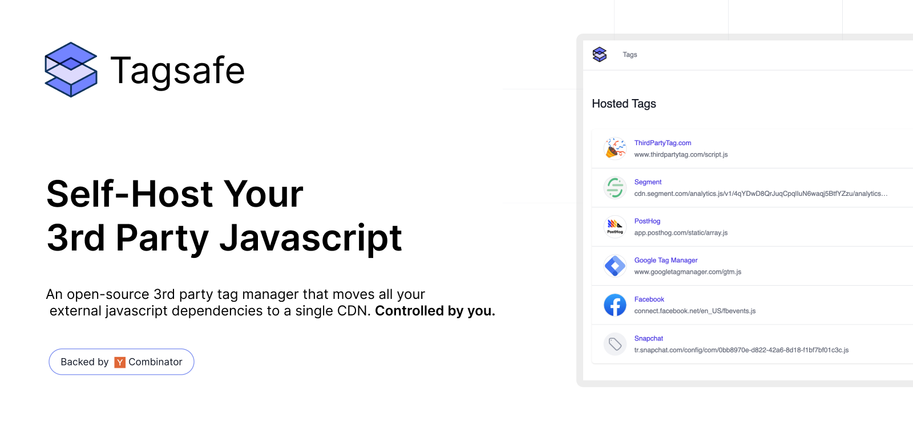

<strong>Tagsafe</strong>

Self-Host Your 3rd Party Javascript

 

<a href="https://tagsafe.io">Website</a>
 · 
<a href="https://github.com/swishjam/tagsafe">GitHub</a>

Swishjam - Open-source tool to monitor frontend performance</a>

## Instructions
- more installation and setup instructions coming!